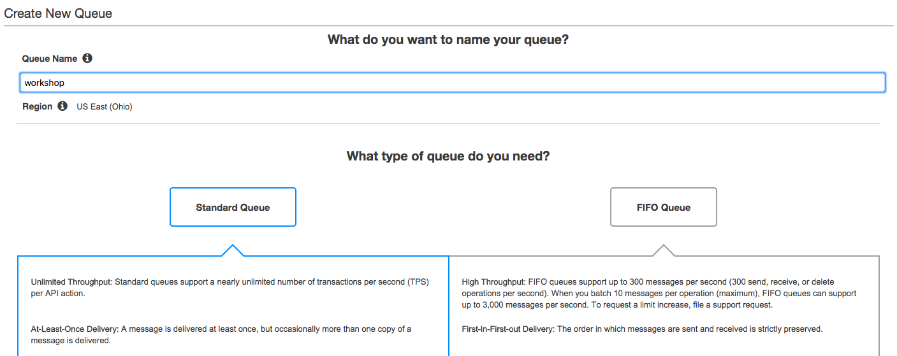
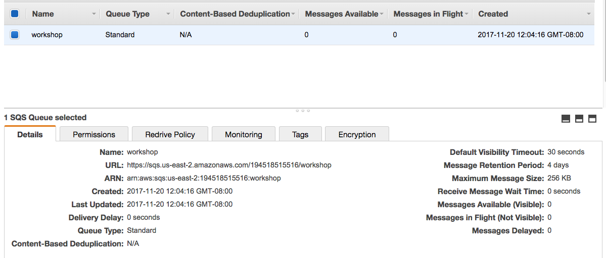
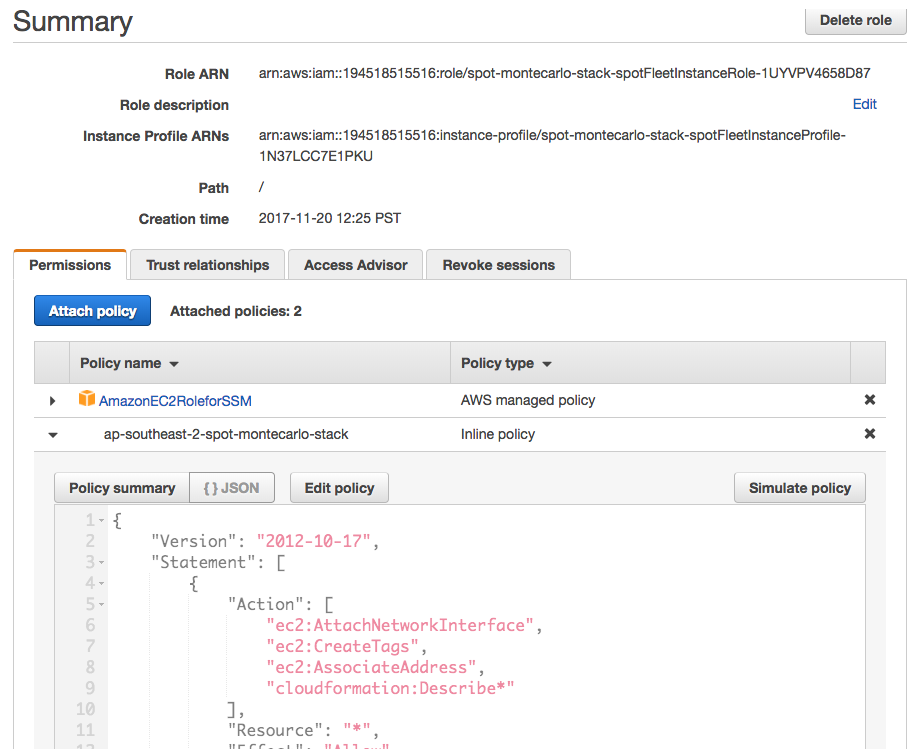
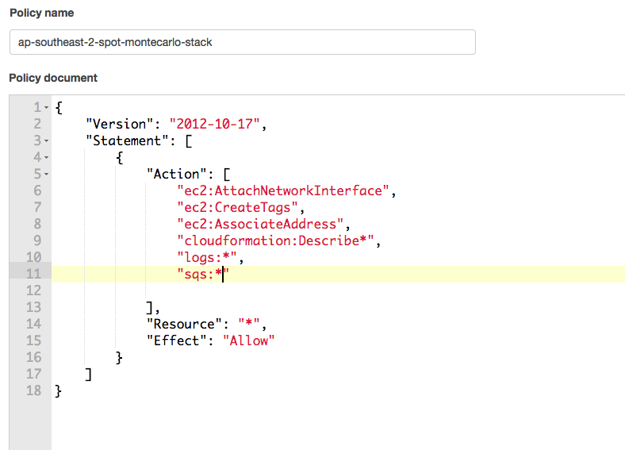
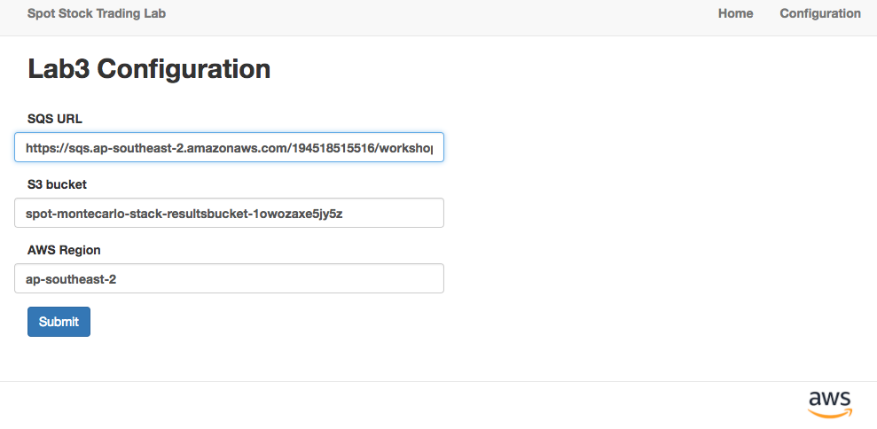

# Hedge Your Own Funds: Run Monte Carlo Simulations on Amazon EC2 Spot Fleets: Lab Guide

* [Introduction](#intro)
	* [Requirements](#req)
	* [Lab Overview](#labs)
	* [Conventions](#conventions)
	* [Workshop Cleanup](#clean)
* [Let's Begin!](#begin)
	* [Lab 1 - Set up the Workshop Environment on AWS](#lab1)
	* [Lab 2 - Explore the Algorithmic Trading Concepts with Jupyter ](#lab2)
	* [Lab 3 - Deploy an Automated Trading Strategy with EC2 Spot Fleet](#lab3)
	* [Lab	4 - Leverage a Fully Managed Solution using AWS Batch](#lab4)
* [Clean Up](#cleanup)

## Introduction:  
Algorithmic trading, or algo-trading is the process of using algorithms for placing a stock trade based on a set of perceived market conditions. These algorithms are based on price, quantity or other mathematical model without the risk of human emotion influencing the buy or sell action. This workshop will walk your through some of the basic tools and concepts that algorithmic traders employ to build fully automated trading systems. 

Monte Carlo Simulations involve repeated random sampling to model the probability of a complex problem that is difficult to predict using other methods due to the nature of the variables involved. We will use Monte Carlo Simulations to simulate and predict future stock movement by repeatedly sampling random stock values based on past results. 

The goal of this workshop is not to become financial gurus. I doubt we'll be rich at the end, but hopefully we'll have learned different ways to build batch processing pipelines using AWS services and save up to 90% using EC2 Spot Fleets. 

If you'd like to learn more: [Basics of Algorithmic Trading: Concepts and Examples](https://www.investopedia.com/articles/active-trading/101014/basics-algorithmic-trading-concepts-and-examples.asp)

### Requirements:  
* AWS account - if you don't have one, it's easy and free to [create one](https://aws.amazon.com/)
* AWS IAM account with elevated privileges allowing you to interact with CloudFormation, IAM, EC2, SQS, and AWS Batch
* A workstation or laptop with an ssh client installed, such as [putty](http://www.putty.org/) on Windows or terminal or iterm on Mac
* Familiarity with Python, [Jupyter](http://jupyter.org/), AWS, and basic understanding of [algorithmic stock trading](http://www.investopedia.com/articles/active-trading/101014/basics-algorithmic-trading-concepts-and-examples.asp)  - not required but a bonus

### Lab Overview:  
These labs are designed to be completed in sequence.  If you are reading this at a live AWS event, the workshop attendants will give you a high level run down of the labs.  Then it's up to you to follow the instructions below to complete the labs.  Don't worry if you're embarking on this journey in the comfort of your office or home - presentation materials can be found in the git repo in the top-level [presentation](https://github.com/awslabs/spot-montecarlo-workshop/tree/master/presentation) folder.

**Lab 1:** Setup the workshop environment on AWS  
**Lab 2:** Explore the Algorithmic Trading Concepts with Jupyter  
**Lab 3:** Deploy an Automated Trading Strategy  

### Conventions:  
Throughout this README, we provide commands for you to run in the terminal.  These commands will look like this: 

<pre>
$ ssh -i <b><i>PRIVATE_KEY.PEM</i></b> ec2-user@<b><i>EC2_PUBLIC_DNS_NAME</i></b>
</pre>

The command starts after `$`.  Words that are ***UPPER_ITALIC_BOLD*** indicate a value that is unique to your environment.  For example, the ***PRIVATE\_KEY.PEM*** refers to the private key of an SSH key pair that you've created, and the ***EC2\_PUBLIC\_DNS\_NAME*** is a value that is specific to an EC2 instance launched in your account.  

### Workshop Cleanup:
This section will appear again below as a reminder because you will be deploying infrastructure on AWS which will have an associated cost.  Fortunately, this workshop should take no more than 2 hours to complete, so costs will be minimal.  See the appendix for an estimate of what this workshop should cost to run.  When you're done with the workshop, follow these steps to make sure everything is cleaned up.

1. Delete any manually created resources throughout the labs.  
2. Delete any data files stored on S3.  
3. Delete the CloudFormation stack launched at the beginning of the workshop.

## Let's Begin!  

### Lab 1 - Set up the Workshop Environment on AWS: 

#### Create an SSH Key   

1.  First, you'll need to select a [region](http://docs.aws.amazon.com/AWSEC2/latest/UserGuide/using-regions-availability-zones.html). For this lab, you will need to choose a region where the AWS-provided Deep Learning AMI is available. (See Step 3 for a full list.) At the top right hand corner of the AWS Console, you'll see a **Support** dropdown. To the left of that is the region selection dropdown.

2. Then you'll need to create an SSH key pair which will be used to login to the instances once provisioned.  Go to the EC2 Dashboard and click on **Key Pairs** in the left menu under Network & Security.  Click **Create Key Pair**, provide a name (can be anything, make it something memorable) when prompted, and click **Create**.  Once created, the private key in the form of .pem file will be automatically downloaded.  

3. If you're using linux or mac, change the permissions of the .pem file to be less open.  

	$ chmod 400 <b><i>PRIVATE_KEY.PEM</i></b>

	>If you're on windows you'll need to convert the .pem file to .ppk to work with putty.  Here is a link to instructions for the file conversion - [Connecting to Your Linux Instance from Windows Using PuTTY](http://docs.aws.amazon.com/AWSEC2/latest/UserGuide/putty.html)

#### Launch the Workshop template
For your convenience, we provide a CloudFormation template to stand up the core infrastructure.  

The template sets up a VPC, IAM roles, S3 bucket, and an EC2 Instance. The EC2 instance will run a Jupyter Notebook which we will leverage in Lab 2 and a small website that we will use in Lab 3. The idea is to provide a contained environment, so as not to interfere with any other provisioned resources in your account.  In order to demonstrate cost optimization strategies, the EC2 Instance is an [EC2 Spot Instance](https://aws.amazon.com/ec2/spot/) deployed by [Spot Fleet](http://docs.aws.amazon.com/AWSEC2/latest/UserGuide/spot-fleet.html).  If you are new to [CloudFormation](https://aws.amazon.com/cloudformation/), take the opportunity to review the [template](https://github.com/awslabs/spot-motecarlo-workshop/blob/master/lab-1-setup/cfn-templates/spot-montecarlo-workshop.yaml) during stack creation.

>**Important:** Prior to launching a stack, be aware that a few of the resources launched need to be manually deleted when the workshop is over. When finished working, please review the "Workshop Cleanup" section to learn what manual teardown is required by you.

1. Click on one of these CloudFormation templates that matches the region you created your keypair in to launch your stack:  

	Region | Launch Template
	------------ | -------------  
	**N. Virginia** (us-east-1) |  
	**Ohio** (us-east-2) |   
	**Oregon** (us-west-2) | 
	**Ireland** (eu-west-1) | 
	**Tokyo** (ap-northeast-1) |  
	**Seoul** (ap-northeast-2) | 
	**Sydney** (ap-southeast-2) | 

2. The template will automatically bring you to the CloudFormation Dashboard and start the stack creation process in the specified region. Click **Next** on the page it brings you to. Do not change anything on the first screen.

	First Screen
	
	
	Parameters Screen
	
  
3. Select a password to use for the Jupyter Notebook. You will use this password in Lab 2. 
4. The default port for the Jupyter Notebook is 8888. Some corporate firewalls and VPNs will block this port. You can change the **JupyterPort** to 443 to get around this. 
5. Select your ssh key. 
>**Important:** On the parameter selection page of launching your CloudFormation stack, make sure to choose the key pair that you created in step 1. If you don't see a key pair to select, check your region and try again.
6. After you've selected your ssh key pair, click **Next**.
7. On the **Options** page, accept all defaults - you don't need to make any changes. Click **Next**. 
8. On the **Review** page, under **Capabilities** check the box next to **"I acknowledge that AWS CloudFormation might create IAM resources."** and click **Create**. Your CloudFormation stack is now being created.
9. Periodically check on the stack creation process in the CloudFormation Dashboard.  Your stack should show status **CREATE\_COMPLETE** in roughly 10-15 minutes. In the Outputs tab, take note of the **Jupyter** and **Web Server** values; you will need these in the next two labs. 
	
	
	
10. Click on the Output URLs for **Jupyter** and **Web Server**. Each should load a web page confirming that the environment has been deployed correctly. We have created a self-signed certificate for the Jupyter Notebook. You will see messages about an unsafe connection. It is safe to ignore these warnings and continue. The steps will differ depending on your browser.

	Certificate Warning
	
	
	Jupyter
	
	
	Web
	

If there was an error during the stack creation process, CloudFormation will rollback and terminate.  You can investigate and troubleshoot by looking in the Events tab.  Any errors encountered during stack creation will appear in the event log. 

**You've completed Lab 1, Congrats!**    

### Lab 2 - Explore the Algorithmic Trading Concepts with Jupyter:

The [Jupyter Notebook](http://jupyter.org/) allows you to create and share documents that contain live code, equations, visualizations and narrative text.

1. Log into the Jupyter Notebook using the **Jupyter** URL output from the CloudFormation Template using the password you configured when building the stack.  We have created a self-signed certificate for the Jupyter Notebook. You will see messages about an unsafe connection. It is safe to ignore these warnings and continue. The steps will differ depending on your browser.

	

2. Click on the notebook named *monte-carlo-workshop.ipynb* and it should open in a new tab.
3. Follow the instructions in the Notebook to complete Lab 2. If you're new to Jupyter, you press shift-enter to run code and/or proceed to the next section. When you're done with the Notebook, return here and we'll take the concepts we learned in this lab and build our own automated pipeline.

**You've completed Lab 2, Congrats!**

### Lab 3 - Deploy an Automated Trading Strategy on EC2 Spot Fleet:

Now that we understand the basics of our trading strategy, lets get our hands dirty building out the batch processing pipeline. 

#### Create the SQS Queue
We will start by creating a managed message queue to store the batch job parameters.

1. Go to the SQS Console, if you haven't used the service in this region, click **Get Started Now**. Otherwise, click **Create New Queue**.
2. Name your queue *"Workshop"*. Select **Standard Queue**. Click **Quick-Create Queue**.
	
	

>For regions that don't yet support FIFO queues, the console may look different than shown. Just name the queue and accept the defaults.

3. Save the queue **Name** and **URL** for later use.
	
	
	

#### Edit the EC2 Instance Profile
Our EC2 instances run with an Instance Profile that contains an IAM role giving the instance permissions to interact with other AWS services. We need to edit the associated policy with permissions to access the SQS service.

1. Go to the EC2 Console.
2. Under **Instances**, select the instance named *montecarlo-workshop*.
3. Scroll down and select the **IAM Role**.
4. You should see two attached policies. One will be an inline policy named after the workshop. Click the arrow beside the policy and click **Edit policy**.

	

5. Under *Actions*, place a comma after `"cloudformation:Describe*"`.
6. Add a new entry `"sqs:*"`which will give permission for all SQS actions. Click **Validate Policy**.

	

7. If the policy is valid, click **Save**.

#### Configure the Web Client
The CloudFormation template deployed a web server that will serve as the user interface. We need to configure it with our SQS queue

1. Launch Web Site using the URL from the CloudFormation output.
2. Click **Configuration**
3. Configure the **SQS URL**, **S3 Bucket Name**, and **AWS Region** using the output values from the CloudFormation stack.

	

4. Click **Submit** and then click **Home** to return to the home page.

#### Configure our Simulation 
1. Enter you simulation details. You can select whatever values you'd like, but too large of an iteration count, may take a long time to complete. We recommend the following configuration.
	* Stock Symbol (e.g. AMZN)
	* Short Window = 40 days
	* Long Window = 100 days
	* Trading Days  = 1260 (5 years)
	* Iterations = 2000
	* Preview Only = *unchecked* - You can use this to see the json message placed on the queue. 

#### View the messages in SQS
1. Go to the SQS Console and select your queue.
2. Under **Queue Actions**, select **View/Delete Messages**. 
3. Click on **Start Polling for Messages**
4. You should see the message that was created by the web client. Explore the message attributes to see what we will be passing to the worker script
5. Now that we have messages on the queue, lets spin up some workers on EC2 spot instances.

#### Create the Spot Worker Fleet
1. From the EC2 Console, select **Spot Requests** and click **Request Spot Instances**.
3. Select **Request and Maintain** to create a fleet of Spot Instances.
4. For **Target Capacity**, type **2**
5. Leave the Amazon Linux AMI as the Default.
6. Each EC2 Instance type and family has it's own independent Spot Market price. Under **Instance Types**, Click **Select** and pick the *c3.xlarge*, *c3.2xlarge*, and *c4.xlarge* to diversify our fleet. Click **Select** again to return to the previous screen.
7.  For **Allocation Strategy**, pick **Diversified**.
8. For **Network**, pick the VPC we created for the Spot Monte Carlo Workshop.
9. Under Availability Zone, check the box next to the first two AZs. The Network Subnet should auto-populate. If the subnet dropdown box says *"No subnets in this zone*, uncheck and select another AZ
10.  Select **Use automated bidding**
11. Click **Next**
12. We will use User Data to bootstrap our work nodes. Copy and paste the [spotlabworker.sh](https://github.com/aws-samples/ec2-spot-montecarlo-workshop/blob/master/templates/spotlabworker.sh) code from the repo We recommend using grabbing the latest code from the repo, but you can review the script below.

	<pre>
	#!/bin/bash
	# Install Dependencies
	yum -y install git python-numpy python-matplotlib	python-scipy
	pip install pandas-datareader
	pip install scipy 
	pip install boto3
	
	#Populate Variables
	REGION=`curl http://169.254.169.254/latest/dynamic/instance-identity/document|grep region|awk -F\" '{print $4}'`
	mkdir /home/ec2-user/spotlabworker
	chown ec2-user:ec2-user /home/ec2-user/spotlabworker
	cd /home/ec2-user/spotlabworker
	WEBURL=$(aws cloudformation --region $REGION describe-stacks --query 'Stacks[0].Outputs[?OutputKey==`WebInterface`].OutputValue' --output text)
	
	#Download the worker code
	wget $WEBURL/static/queue_processor.py
	wget $WEBURL/static/worker.py
	
	#Configure the worker with the proper inputs
	echo "QUEUE = 'Workshop'" > config.py
	echo "REGION = '$REGION'" >> config.py
	
	#Start the worker processor
	python /home/ec2-user/spotlabworker/queue_processor.py > stdout.txt 2>&1
	</pre>  
12. Under **Tags**, Enter *Name* for **Key**. Enter **WorkerNode** for *Value*.
13. Under **IAM instance profile**, pull the dropdown and select the profile beginning with the workshop name you configured in the CloudFormation Template.
13. Select the Security Group named after your Workshop.
14. We will accept the rest of the defaults, but take a moment at look at the options that you can configure for your Spot Fleet
	* **Health Checks**
	* **Interruption behavior**
	* **Load Balancer registration**
	* **EBS Optimized**
15. Click **Review**, review your settings, and then click **Launch**.
16. Wait until the request is fulfilled, capacity shows the specified number of Spot instances, and the status is Active.
17. Once the workers come up, they should start processing the SQS messages automatically. Feel free to create some more jobs from the webpage.

#### Evaluate the Results
1. Check your S3 Bucket. In a few minutes you should see results start appearing the bucket. 
2. If you monitor the SQS queue for messages you should see them being picked up by the worker nodes. 

**You've completed Lab 3, Congrats!**

#### Extra Credit
* Use [AWS QuickSight](https://https://quicksight.aws/) to build visualizations, perform ad-hoc analysis, and quickly get business insights from your data
* Each job is handled fully by one worker. Maybe you could look at adding more parallelism to task scheduler.
* Configure Auto Scaling for your Spot Fleet based on SQS Queue Depth

### Lab	4 - Leverage a Fully Managed Solution using AWS Batch 

Coming Soon!

## Clean Up
Hopefully you've enjoyed the workshop and learned a few new things. Now follow these steps to make sure everything is cleaned up.

1. In the EC2 Console > Spot Requests, click **Cancel Spot request** under **Actions**. Make sure **Terminate instances** is checked.
2. In the SQS Console, delete the queue that you created earlier. This is located under **Queue Actions**.
3. In the S3 Console, locate the resultsBucket that was created for your workshop. Click on the bucket and select **Empty bucket**. You will need to copy and paste the bucket name in to confirm the aciton. 
4. In the CloudFormation template, select the workshop stack and select **Actions** and then **Delete stack**.

##Appendix

### Estimated Costs
The estimated cost for running this 2.5 hour workshop will be less than $5.

### Learning Resources:

