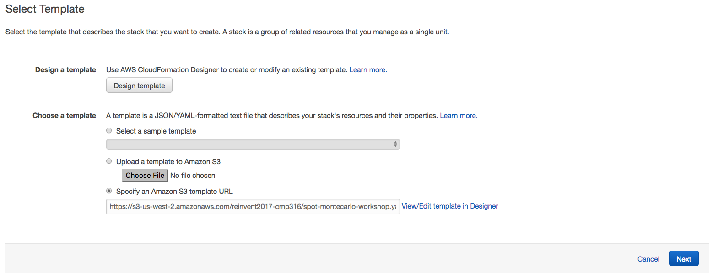
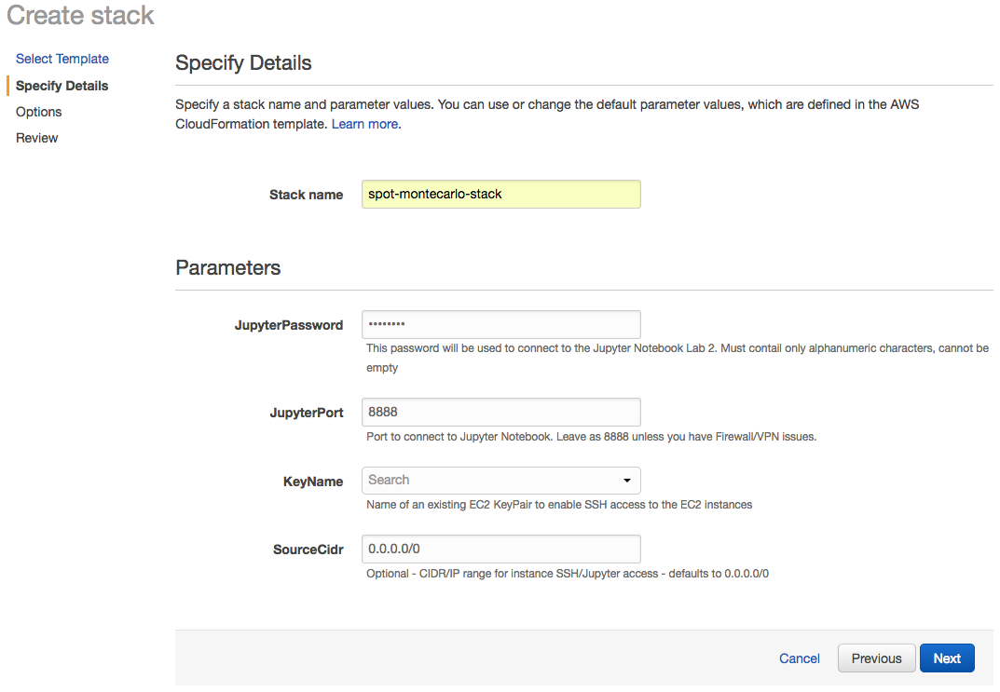

# Hedge Your Own Funds: Run Monte Carlo Simulations on Amazon EC2 Spot Fleets: Lab Guide

## Overview: 

### Requirements:  
* AWS account - if you don't have one, it's easy and free to [create one](https://aws.amazon.com/)
* AWS IAM account with elevated privileges allowing you to interact with CloudFormation, IAM, EC2, SQS, and CloudWatch Logs
* A workstation or laptop with an ssh client installed, such as [putty](http://www.putty.org/) on Windows or terminal or iterm on Mac
* Familiarity with Python, [Jupyter](http://jupyter.org/), AWS, and basic understanding of [algorthimic stock trading](http://www.investopedia.com/articles/active-trading/101014/basics-algorithmic-trading-concepts-and-examples.asp)  - not required but a bonus

### Labs:  
These labs are designed to be completed in sequence.  If you are reading this at a live AWS event, the workshop attendants will give you a high level run down of the labs.  Then it's up to you to follow the instructions below to complete the labs.  Don't worry if you're embarking on this journey in the comfort of your office or home - presentation materials can be found in the git repo in the top-level [presentation](https://github.com/awslabs/spot-montecarlo-workshop/tree/master/presentation) folder.

**Lab 1:** Setup the workshop environment on AWS  
**Lab 2:** Explore the Algorithmic Trading Concepts with Jupyter  
**Lab 3:** Deploy an Automated Trading Strategy  

### Conventions:  
Throughout this README, we provide commands for you to run in the terminal.  These commands will look like this: 

<pre>
$ ssh -i <b><i>PRIVATE_KEY.PEM</i></b> ec2-user@<b><i>EC2_PUBLIC_DNS_NAME</i></b>
</pre>

The command starts after $.  Words that are ***UPPER_ITALIC_BOLD*** indicate a value that is unique to your environment.  For example, the ***PRIVATE\_KEY.PEM*** refers to the private key of an SSH key pair that you've created, and the ***EC2\_PUBLIC\_DNS\_NAME*** is a value that is specific to an EC2 instance launched in your account.  

### Workshop Cleanup:
This section will appear again below as a reminder because you will be deploying infrastructure on AWS which will have an associated cost.  Fortunately, this workshop should take no more than 2 hours to complete, so costs will be minimal.  See the appendix for an estimate of what this workshop should cost to run.  When you're done with the workshop, follow these steps to make sure everything is cleaned up.

1. Delete any manually created resources throughout the labs.  
2. Delete any data files stored on S3.  
3. Delete the CloudFormation stack launched at the beginning of the workshop.

## Let's Begin!  

### Lab 1 - Set up the Workshop Environment on AWS:    

1. First, you'll need to select a [region](http://docs.aws.amazon.com/AWSEC2/latest/UserGuide/using-regions-availability-zones.html). For this lab, you will need to choose a region where the AWS-provided Deep Learning AMI is available. (See Step 3 for a full list.) At the top right hand corner of the AWS Console, you'll see a **Support** dropdown. To the left of that is the region selection dropdown.

2. Then you'll need to create an SSH key pair which will be used to login to the instances once provisioned.  Go to the EC2 Dashboard and click on **Key Pairs** in the left menu under Network & Security.  Click **Create Key Pair**, provide a name (can be anything, make it something memorable) when prompted, and click **Create**.  Once created, the private key in the form of .pem file will be automatically downloaded.  

If you're using linux or mac, change the permissions of the .pem file to be less open.  

<pre>$ chmod 400 <b><i>PRIVATE_KEY.PEM</i></b></pre>

If you're on windows you'll need to convert the .pem file to .ppk to work with putty.  Here is a link to instructions for the file conversion - [Connecting to Your Linux Instance from Windows Using PuTTY](http://docs.aws.amazon.com/AWSEC2/latest/UserGuide/putty.html)

3. For your convenience, we provide a CloudFormation template to stand up the core infrastructure.  

*Prior to launching a stack, be aware that a few of the resources launched need to be manually deleted when the workshop is over. When finished working, please review the "Workshop Cleanup" section to learn what manual teardown is required by you.*

4. Click on one of these CloudFormation templates that matches the region you created your keypair in to launch your stack:  

Region | Launch Template
------------ | -------------  
**N. Virginia** (us-east-1) |  
**Ohio** (us-east-2) |   
**Oregon** (us-west-2) | 
**Ireland** (eu-west-1) | 
**Tokyo** (ap-northeast-1) |  
**Seoul** (ap-northeast-2) | 
**Sydney** (ap-southeast-2) | 

The template will automatically bring you to the CloudFormation Dashboard and start the stack creation process in the specified region. Click **Next** on the page it brings you to. Do not change anything on the first screen.

The template sets up a VPC, IAM roles, S3 bucket, and an EC2 Instance. The EC2 instance will run a Jupyter Notebook which we will leverage in Lab 2 and a small website that we will use in Lab 3. The idea is to provide a contained environment, so as not to interfere with any other provisioned resources in your account.  In order to demonstrate cost optimization strategies, the EC2 Instance is an [EC2 Spot Instance](https://aws.amazon.com/ec2/spot/) deployed by [Spot Fleet](http://docs.aws.amazon.com/AWSEC2/latest/UserGuide/spot-fleet.html).  If you are new to [CloudFormation](https://aws.amazon.com/cloudformation/), take the opportunity to review the [template](https://github.com/awslabs/spot-motecarlo-workshop/blob/master/lab-1-setup/cfn-templates/spot-montecarlo-workshop.yaml) during stack creation.

**IMPORTANT**  
*On the parameter selection page of launching your CloudFormation stack, make sure to choose the key pair that you created in step 1. If you don't see a key pair to select, check your region and try again.*

**Create the stack**  
Select a password to use for the Jupyter Notebook. You will use this password in Lab 2. After you've selected your ssh key pair, click **Next**. On the **Options** page, accept all defaults- you don't need to make any changes. Click **Next**. On the **Review** page, under **Capabilities** check the box next to **"I acknowledge that AWS CloudFormation might create IAM resources."** and click **Create**. Your CloudFormation stack is now being created.

**Checkpoint**  
Periodically check on the stack creation process in the CloudFormation Dashboard.  Your stack should show status **CREATE\_COMPLETE** in roughly 5-10 minutes.  In the Outputs tab, take note of the **Jupyter** and **Web Server** values; you will need these in the next two labs.     

Note that when your stack moves to a **CREATE\_COMPLETE** status, you won't necessarily see EC2 instances yet. If you don't, go to the EC2 console and click on **Spot Requests**. There you will see the pending or fulfilled spot requests. Once they are fulfilled, you will see your EC2 instances within the EC2 console.

If there was an error during the stack creation process, CloudFormation will rollback and terminate.  You can investigate and troubleshoot by looking in the Events tab.  Any errors encountered during stack creation will appear in the event log.      

### Lab 2 - Explore the Algorithmic Trading Concepts with Jupyter:

### Lab 3 - Deploy an Automated Trading Strategy: 

## Extra Credit
* Leverage the [AWS Batch Service](http://docs.aws.amazon.com/batch/latest/userguide/Batch_GetStarted.html) to create a managed batch processing solution
* Use [AWS QuickSight](https://https://quicksight.aws/) to build visualizations, perform ad-hoc analysis, and quickly get business insights from your data
